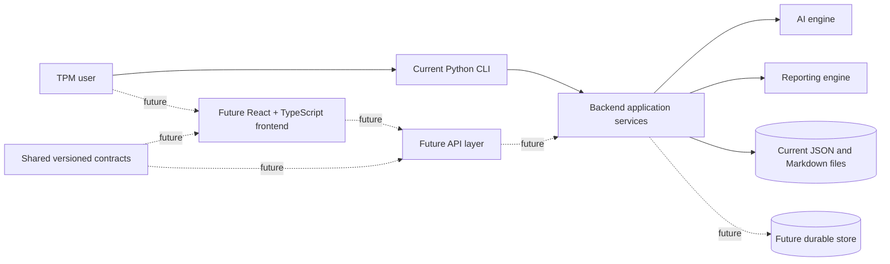

# TPM Operating System Architecture

This document distinguishes the current repository architecture from future product boundaries. Future components should not be interpreted as implemented behavior.

## Product Architecture

TPM Operating System is evolving from a local Python CLI into a production-grade SaaS product through incremental, backward-compatible changes. The repository establishes five durable top-level boundaries:

| Boundary | Responsibility |
|---|---|
| `backend/` | Backend ownership boundary. During this foundation sprint, the working Python implementation remains in `app/` to preserve imports and CLI behavior. |
| `frontend/` | Placeholder for a future React + TypeScript user interface. No frontend runtime exists yet. |
| `shared/` | Placeholder for versioned, implementation-neutral contracts such as schemas and generated models. |
| `docs/` | Product, architecture, operating-model, and engineering documentation. |
| `scripts/` | Repository development, validation, and future operational utilities. |

The intended component relationships are:

Solid lines describe current conceptual relationships; dotted lines are future boundaries and are not implemented.

## Boundary Responsibilities

### Backend

The backend owns program domain behavior, workflow orchestration, validation, persistence coordination, AI integration, persona routing, and report generation. Today those responsibilities are implemented by the existing modules under `app/`. They remain in place because moving them would risk direct imports and the current CLI entry point. The new `backend/` directory records the intended ownership boundary without adding a second implementation.

### Frontend

The future frontend will own browser interaction, accessible presentation, client-side navigation, and view-specific state. It will consume versioned API contracts and must not duplicate backend business rules, prompts, persistence behavior, or AI orchestration. No React or TypeScript application is generated in this sprint.

### Shared Modules

The future shared boundary will hold stable, versioned contracts that genuinely cross process or language boundaries: API request and response schemas, event contracts, and generated model definitions. It will not become a general-purpose utility directory or contain backend business logic. The schema technology and code-generation approach remain undecided.

### Future API Layer

A future API layer will provide authenticated, authorized, tenant-aware access to backend application services. It should translate transport contracts to domain inputs, validate requests, apply access controls, and return stable versioned responses. It must wrap existing behavior rather than reimplement it. No FastAPI server, HTTP routes, authentication, or transport models exist today.

### Reporting Engine

The reporting engine owns transformation of validated program state into audience-specific artifacts. The current implementation is `app/executive.py`, which generates Markdown executive status reports. Future work may add PDF, presentation, scheduled, or template-driven output behind a stable backend interface while preserving deterministic inputs and auditable generated artifacts.

### AI Engine

The AI engine owns model-provider interaction and prompt execution boundaries. Today `app/llm.py`, `app/context_loader.py`, `app/prompt_builder.py`, and the relevant orchestration modules implement this capability using existing Markdown instructions and optional Gemini calls. Prompts and AI behavior remain unchanged in this sprint. Future provider abstraction, evaluation, observability, and safety controls should be added around—not silently alter—the established prompt contracts.

## Current Architecture

The current product is a local CLI application backed by Markdown knowledge assets, JSON program persistence, and optional Gemini API calls.

### Components

| Component | Current Responsibility |
|---|---|
| CLI | Presents menu options, captures user input, and prints feedback. |
| `app/main.py` | Application entry point. Displays product header, version `0.2-dev`, menu options, and delegates routing. |
| `app/router.py` | Routes menu selections for New Program, Active Program, placeholder modes, and exit behavior. |
| `app/persona_router.py` | Provides deterministic, rule-based persona routing from structured program context without requiring Gemini or network access. |
| `app/persona_routing.py` | Application integration boundary for persona routing. It builds non-mutating routing context, calls the router once per CLI operation, handles safe fallback, resolves persona display names, and renders concise CLI output. |
| `app/engine.py` | Runs the New Program analysis flow: loads context, builds prompt, saves prompt, calls Gemini, prints and saves response. |
| `app/llm.py` | Sends prompt payloads to the Gemini API when `GEMINI_API_KEY` is configured. |
| `app/memory.py` | Creates, loads, saves, and lists JSON program records under `data/programs/`. |
| `app/workspace.py` | Provides Active Program Workspace actions for risks, issues, decisions, next actions, health updates, and executive report generation. |
| `app/executive.py` | Generates Markdown Executive Status Reports under `reports/executive/`. |
| `app/context_loader.py` | Loads selected Markdown context files for New Program prompt construction. |
| `app/prompt_builder.py` | Builds the structured New Program prompt sent to the AI model. |
| `app/pdf_extractor.py` | Validates local PDF paths and extracts bounded selectable text with metadata; it does not perform OCR. |
| `app/sow_analysis.py` | Parses and normalizes strict SOW-analysis JSON and maps supported fields into canonical program data without mutating the analysis. |
| `app/sow_intake.py` | Orchestrates extraction, one Gemini call, validation, one persona-routing calculation, persistence, and the initiation summary. |
| Markdown knowledge assets | Provide reusable TPM instructions, frameworks, playbooks, templates, personas, and examples. |
| JSON program persistence | Stores program state locally in `data/programs/*.json`. |
| Gemini API | Provides AI-generated analysis for the New Program flow. |
| Generated sessions and reports | `sessions/last_prompt.md`, `sessions/last_response.md`, and reports under `reports/executive/` are generated at runtime. |

## Main Execution Flow

1. User runs the CLI application.
2. `app/main.py` prints the TPM Operating System header and menu.
3. User selects a menu option.
4. `app/main.py` calls `route(option)` from `app/router.py`.
5. `app/router.py` dispatches to the selected flow.

Current menu entries exist for New Program, Active Program, Major Incident, Executive Review, Operational Readiness, and Exit. Major Incident, Executive Review, and Operational Readiness currently remain placeholder workflows, but they now calculate and display expected persona routing before preserving the existing placeholder message.

## Persona Routing Flow

Sprint 52 integrates deterministic CLI persona routing without introducing multi-agent orchestration.

1. `app/router.py` identifies the selected top-level CLI operation.
2. `app/router.py` calls `route_and_display_personas(...)`, which delegates to `app/persona_routing.py`.
3. `app/persona_routing.py` builds a non-mutating context from available fields such as menu mode, workflow name, user request, program metadata, health, risks, issues, decisions, and next actions.
4. `app/persona_routing.py` calls `route_personas(...)` from `app/persona_router.py` once for the operation.
5. The same calculated routing result is rendered to the CLI using human-readable names from `PERSONA_REGISTRY`.
6. In the New Program flow, that same routing object is passed into `app/engine.py` and then `app/prompt_builder.py`.
7. `app/prompt_builder.py` includes an optional `PERSONA ROUTING CONTEXT` section when routing is supplied.

If routing fails unexpectedly at the application boundary, `app/persona_routing.py` returns a valid default Technical Program Manager routing result and the CLI prints a concise warning. The fallback does not expose tracebacks to normal CLI users.

## New Program Flow

1. User selects `Start a New Program`.
2. The user chooses manual description, SOW PDF, or return.
3. The manual path preserves the existing description/name creation, routing, and initial assessment behavior.
4. The SOW path validates a user-provided local PDF, extracts bounded selectable text, and constructs a strict-JSON prompt.
5. `app/llm.py` makes one Gemini call. The response is parsed and normalized in memory.
6. Supported analysis fields map into a canonical program record. Persona routing is calculated once from the initiation context.
7. The program is validated and created without replacing an existing file, then the same routing result and a concise initiation summary are displayed.

The SOW path does not write its prompt, raw response, extracted text, or source PDF to `sessions/` or program storage.

## Active Program Workspace Flow

1. User selects `Manage an Active Program`.
2. `app/router.py` lists available JSON program records from `data/programs/`.
3. User selects a program.
4. `app/router.py` calculates and displays persona routing from the selected program context.
5. `app/workspace.py` loads the selected program and shows a summary.
6. User can perform workspace actions:
   - Add Risk.
   - Add Decision.
   - Add Next Action.
   - Update Health.
   - Generate Executive Report.
   - Add Issue.
   - List Open Issues.
   - Close Issue.
7. `app/memory.py` saves updated program state after mutating actions.
8. `app/executive.py` writes Markdown reports when requested.

## Data Storage

Current data storage is local filesystem storage:

- Program records: `data/programs/*.json`.
- Last generated AI prompt: `sessions/last_prompt.md`.
- Last generated AI response: `sessions/last_response.md`.
- Executive reports: `reports/executive/*.md`.
- Static operating knowledge: Markdown files under `instructions/`, `knowledge/`, `playbooks/`, `templates/`, `personas/`, `examples/`, and `tests/`.

There is no database, schema migration layer, multi-user storage, authentication, or server-side persistence service in the current implementation.

SOW program records store only suitable canonical fields and the source filename. They do not store the original PDF, its full path, extracted document text, or raw Gemini response. Program creation rejects an existing identifier, and updates use validated atomic replacement.

## AI Boundary

The AI model is used in the New Program flow only:

- The system loads selected local Markdown context.
- The system builds a prompt with that context, the user's project description, and optional already-calculated persona routing context.
- The system calls Gemini through `app/llm.py`.
- The system stores the prompt and response as generated session files.

Persona routing does not add Gemini calls. The system does not call one model per persona, simulate an expert debate, or claim independent autonomous agents were executed. The AI does not autonomously modify program JSON, close issues, update health, create reports, upload documents, or operate a web interface. Human CLI input currently drives state-changing workspace actions.

## Persona Routing Foundation

Sprint 51 introduces `app/persona_router.py` as a deterministic routing layer for the documented expert personas. It selects a `primary_persona` and ordered `supporting_personas` from structured context such as requested mode or workflow, program type, phase, health, risks, issues, next actions, and optional free-text user request.

The routing result is a dictionary with this structure:

- `primary_persona`: canonical machine-readable persona identifier.
- `supporting_personas`: ordered list of canonical persona identifiers.
- `reasons`: human-readable explanations of the triggered routing rules.
- `routing_version`: version string for the routing rules.

Canonical persona identifiers are stable strings:

- `technical_program_manager`
- `cloud_architect`
- `incident_commander`
- `executive_advisor`
- `delivery_manager`
- `operations_manager`
- `change_manager`
- `security_advisor`
- `customer_success_advisor`

This layer is intentionally independent of Gemini. It does not call an AI model, create autonomous agents, synthesize council output, mutate program records, or change CLI menu behavior. Deterministic routing comes before multi-agent AI orchestration because the system needs testable persona selection, stable ordering, explainable reasons, and backward-compatible behavior before model calls are composed around those decisions.

## Current Limitations

- CLI-only user experience.
- Local JSON files are the only program persistence mechanism.
- No schema migration framework; compatibility defaults provide additive legacy support.
- Automated coverage uses `unittest`, but there is no separate CI configuration in this repository.
- No implemented web interface.
- No implemented Docker runtime.
- No implemented dependency management with `uv`.
- SOW intake supports selectable-text local PDFs only; there is no upload service, OCR, password prompt, or persisted analysis artifact.
- Major Incident, Executive Review, and Operational Readiness are menu placeholders only.
- Persona routing is integrated at the CLI and New Program prompt boundary, but there is no AI Expert Council orchestration.
- Executive stakeholders such as sponsors, CIOs, CTOs, VPs, steering committees, finance, legal, and PMO leadership remain a future governance or stakeholder layer and are not implemented as a Stakeholder Council.
- Executive report generation is Markdown-only and relatively simple.
- Gemini model availability and behavior depend on external API access and a configured `GEMINI_API_KEY`.
- Persona routing is transient execution context only; there is no program schema change and routing is not persisted to program JSON.

## Future Architecture Considerations

Future architecture may include:

- A web application layer for the Program Workspace.
- A more robust program data model with validation, versioning, and migration support.
- A document ingestion service for SOWs and related program artifacts.
- Deeper persona routing integration with future completed workflows.
- An expert orchestration layer that uses deterministic persona routing to produce TPM-synthesized council reviews.
- A report generation layer for professional PowerPoint, PDF, and executive packages.
- Docker packaging for consistent local and hosted runtime behavior.
- Dependency management through `uv`.
- A durable database if the product moves beyond local single-user operation.
- Authentication, authorization, audit logging, and tenant isolation for any SaaS direction.

These are future considerations and are not implemented in the current codebase.
