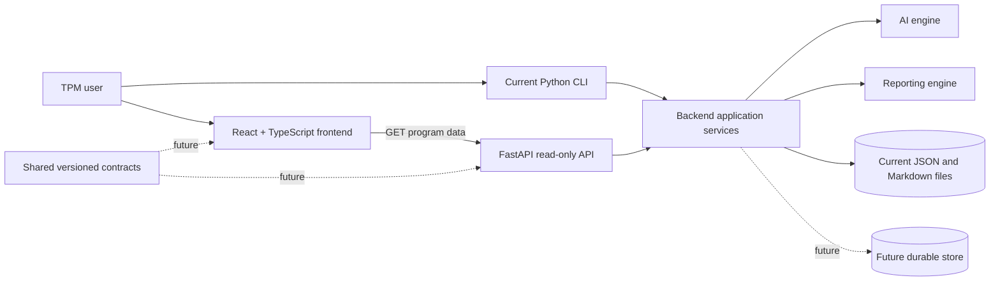

# TPM Operating System Architecture

This document distinguishes the current repository architecture from future product boundaries. Future components should not be interpreted as implemented behavior.

## Release Context

The current product release is **v0.7.0 — Foundation & Experience**. It closes the
first demonstrable architecture baseline: canonical program entities, local JSON
persistence, CLI workflows, a read-only FastAPI boundary, and a React enterprise
application with Command Center and Program Mission Control experiences.

See the canonical [v0.7.0 release document](releases/v0.7.0-foundation-and-experience.md)
for product scope and limitations. The next product version is **v0.8
Intelligence**, and the next engineering sprint is **DX-1.0 Developer Console**.

## Product Architecture

TPM Operating System is evolving from a local Python CLI into a production-grade SaaS product through incremental, backward-compatible changes. The repository establishes five durable top-level boundaries:

| Boundary | Responsibility |
|---|---|
| `backend/` | Backend ownership boundary. During this foundation sprint, the working Python implementation remains in `app/` to preserve imports and CLI behavior. |
| `frontend/` | React + TypeScript browser application with client-side routing and reusable application layout. |
| `shared/` | Placeholder for versioned, implementation-neutral contracts such as schemas and generated models. |
| `docs/` | Product, architecture, operating-model, and engineering documentation. |
| `scripts/` | Repository development, validation, and future operational utilities. |

The intended component relationships are:

Solid lines describe current conceptual relationships. The React frontend calls the FastAPI read-only interface, which delegates program reads to the existing application persistence boundary.

Workspace intelligence follows React → `GET /programs/{programId}/intelligence` →
`app/intelligence.py` → existing context loader, prompt builder, persona routing, and
`app/llm.py`. Generation is explicitly user-triggered; the browser never receives
prompts or credentials.

Workspace Intelligence Contract v1 (`schema_version: 1.0.0`) replaces parallel string
arrays with categorized findings, structured recommendations, decisions required, and
one prioritized next action. The backend extracts one bounded program snapshot and a
catalog of nonempty RFC 6901 JSON Pointer evidence paths. Gemini may reference only
that catalog and uses array indexes for relationships; the strict parser validates the
complete provider result before the backend assigns deterministic SHA-256-based IDs and
resolves relationships. Provider or validation failure produces a complete deterministic
result through the same contract finalizer. AI and fallback results therefore have the
same response schema, while `source` identifies their generation path.

## Boundary Responsibilities

### Backend

The backend owns program domain behavior, workflow orchestration, validation, persistence coordination, AI integration, persona routing, report generation, and HTTP transport. Domain and persistence responsibilities remain implemented by the existing modules under `app/` because moving them would risk direct imports and the current CLI entry point. The read-only FastAPI transport under `backend/api/` calls the existing persistence boundary rather than adding a second implementation.

### Frontend

The frontend owns browser interaction, accessible presentation, client-side navigation, and view-specific state. It retrieves program lists and individual workspaces from the API configured by `VITE_API_BASE_URL`. A centralized Fetch client handles GET URLs, JSON responses, cancellation, and transport errors. The frontend does not duplicate backend business rules, prompts, persistence behavior, or AI orchestration.

### Shared Modules

The future shared boundary will hold stable, versioned contracts that genuinely cross process or language boundaries: API request and response schemas, event contracts, and generated model definitions. It will not become a general-purpose utility directory or contain backend business logic. The schema technology and code-generation approach remain undecided.

### API Layer

`backend/api/` is a read-only FastAPI interface. Its routers expose health and program reads, while `dependencies.py` adapts `app/memory.py` for transport use. `compat.py` provides the minimum import bridge needed by the existing script-oriented application modules. It does not duplicate persistence, normalization, schema, or business rules. The CLI and API therefore remain separate interfaces over the same application behavior.

The API returns the flexible normalized dictionaries produced by persistence so legacy-compatible records are not rejected by speculative transport models. Missing programs and persistence failures use a structured JSON error envelope. Unexpected server exceptions are logged, while responses omit stack traces and internal filesystem paths.

FastAPI publishes Swagger UI at `/docs` and OpenAPI JSON at `/openapi.json`. The default CORS allowlist contains the two Vite development origins on port 5173; `TPM_API_CORS_ORIGINS` adds comma-separated origins, and credentials remain disabled. Authentication, authorization, tenant isolation, mutations, search, filtering, sorting, and pagination are not implemented.

### Reporting Engine

The reporting engine owns transformation of validated program state into audience-specific artifacts. The current implementation is `app/executive.py`, which generates Markdown executive status reports. Future work may add PDF, presentation, scheduled, or template-driven output behind a stable backend interface while preserving deterministic inputs and auditable generated artifacts.

### AI Engine

The AI engine owns model-provider interaction and prompt execution boundaries. Today `app/llm.py`, `app/context_loader.py`, `app/prompt_builder.py`, and the relevant orchestration modules implement this capability using existing Markdown instructions and optional Gemini calls. Prompts and AI behavior remain unchanged in this sprint. Future provider abstraction, evaluation, observability, and safety controls should be added around—not silently alter—the established prompt contracts.

For workspace intelligence, `app/intelligence.py` deep-copies the supplied program,
calculates persona routing once, builds a bounded snapshot, and requests one strict
JSON response. `app/intelligence_analysis.py` validates the exact field set, string
and collection limits, and confidence enum with all-or-fallback behavior. The
existing Gemini credential/model convention is reused with a 20-second timeout and
no retry.

Provider, configuration, timeout, empty-output, and parsing failures return visibly
labeled grounded deterministic fallback. Persistence and unexpected application
failures remain sanitized HTTP errors. Neither AI nor fallback calls `save_program`,
writes session files, or persists intelligence. Transport excludes prompts,
provider payloads, keys, routing reasons, hidden reasoning, exception details, and
filesystem paths. Results are session-only; there is no streaming, polling, cache,
background job, authentication, or authorization.

## Current Architecture

The current product is a local CLI application backed by Markdown knowledge assets, JSON program persistence, and optional Gemini API calls.

### Components

| Component | Current Responsibility |
|---|---|
| CLI | Presents menu options, captures user input, and prints feedback. |
| `backend/api/main.py` | Creates the FastAPI application, registers routes and structured error handling, and configures CORS. |
| `backend/api/dependencies.py` | Provides a thin read-only adapter over the existing program persistence service. |
| `backend/api/routers/` | Exposes health and program-read HTTP endpoints. |
| `app/main.py` | Application entry point. Displays product header, version `0.2-dev`, menu options, and delegates routing. |
| `app/application_version.py` | Holds the application version shared by the unchanged CLI banner and API health metadata. |
| `app/router.py` | Routes menu selections for New Program, Active Program, placeholder modes, and exit behavior. |
| `app/persona_router.py` | Provides deterministic, rule-based persona routing from structured program context without requiring Gemini or network access. |
| `app/persona_routing.py` | Application integration boundary for persona routing. It builds non-mutating routing context, calls the router once per CLI operation, handles safe fallback, resolves persona display names, and renders concise CLI output. |
| `app/engine.py` | Runs the New Program analysis flow: loads context, builds prompt, saves prompt, calls Gemini, prints and saves response. |
| `app/llm.py` | Sends prompt payloads to the Gemini API when `GEMINI_API_KEY` is configured. |
| `app/memory.py` | Creates, loads, saves, and lists JSON program records under `data/programs/`. |
| `app/workspace.py` | Provides Active Program Workspace actions for risks, issues, decisions, next actions, health updates, and executive report generation. |
| `app/executive.py` | Generates Markdown Executive Status Reports under `reports/executive/`. |
| `app/context_loader.py` | Loads selected Markdown context files for New Program prompt construction. |
| `app/prompt_builder.py` | Builds the structured New Program prompt sent to the AI model. |
| `app/pdf_extractor.py` | Validates local PDF paths and extracts bounded selectable text with metadata; it does not perform OCR. |
| `app/sow_analysis.py` | Parses and normalizes strict SOW-analysis JSON and maps supported fields into canonical program data without mutating the analysis. |
| `app/sow_intake.py` | Orchestrates extraction, one Gemini call, validation, one persona-routing calculation, persistence, and the initiation summary. |
| Markdown knowledge assets | Provide reusable TPM instructions, frameworks, playbooks, templates, personas, and examples. |
| JSON program persistence | Stores program state locally in `data/programs/*.json`. |
| Gemini API | Provides AI-generated analysis for the New Program flow. |
| Generated sessions and reports | `sessions/last_prompt.md`, `sessions/last_response.md`, and reports under `reports/executive/` are generated at runtime. |

## Main Execution Flow

1. User runs the CLI application.
2. `app/main.py` prints the TPM Operating System header and menu.
3. User selects a menu option.
4. `app/main.py` calls `route(option)` from `app/router.py`.
5. `app/router.py` dispatches to the selected flow.

Current menu entries exist for New Program, Active Program, Major Incident, Executive Review, Operational Readiness, and Exit. Major Incident, Executive Review, and Operational Readiness currently remain placeholder workflows, but they now calculate and display expected persona routing before preserving the existing placeholder message.

## Persona Routing Flow

Sprint 52 integrates deterministic CLI persona routing without introducing multi-agent orchestration.

1. `app/router.py` identifies the selected top-level CLI operation.
2. `app/router.py` calls `route_and_display_personas(...)`, which delegates to `app/persona_routing.py`.
3. `app/persona_routing.py` builds a non-mutating context from available fields such as menu mode, workflow name, user request, program metadata, health, risks, issues, decisions, and next actions.
4. `app/persona_routing.py` calls `route_personas(...)` from `app/persona_router.py` once for the operation.
5. The same calculated routing result is rendered to the CLI using human-readable names from `PERSONA_REGISTRY`.
6. In the New Program flow, that same routing object is passed into `app/engine.py` and then `app/prompt_builder.py`.
7. `app/prompt_builder.py` includes an optional `PERSONA ROUTING CONTEXT` section when routing is supplied.

If routing fails unexpectedly at the application boundary, `app/persona_routing.py` returns a valid default Technical Program Manager routing result and the CLI prints a concise warning. The fallback does not expose tracebacks to normal CLI users.

## New Program Flow

1. User selects `Start a New Program`.
2. The user chooses manual description, SOW PDF, or return.
3. The manual path preserves the existing description/name creation, routing, and initial assessment behavior.
4. The SOW path validates a user-provided local PDF, extracts bounded selectable text, and constructs a strict-JSON prompt.
5. `app/llm.py` makes one Gemini call. The response is parsed and normalized in memory.
6. Supported analysis fields map into a canonical program record. Persona routing is calculated once from the initiation context.
7. The program is validated and created without replacing an existing file, then the same routing result and a concise initiation summary are displayed.

The SOW path does not write its prompt, raw response, extracted text, or source PDF to `sessions/` or program storage.

## Active Program Workspace Flow

1. User selects `Manage an Active Program`.
2. `app/router.py` lists available JSON program records from `data/programs/`.
3. User selects a program.
4. `app/router.py` calculates and displays persona routing from the selected program context.
5. `app/workspace.py` loads the selected program and shows a summary.
6. User can perform workspace actions:
   - Add Risk.
   - Add Decision.
   - Add Next Action.
   - Update Health.
   - Generate Executive Report.
   - Add Issue.
   - List Open Issues.
   - Close Issue.
7. `app/memory.py` saves updated program state after mutating actions.
8. `app/executive.py` writes Markdown reports when requested.

## Data Storage

Current data storage is local filesystem storage:

- Program records: `data/programs/*.json`.
- Last generated AI prompt: `sessions/last_prompt.md`.
- Last generated AI response: `sessions/last_response.md`.
- Executive reports: `reports/executive/*.md`.
- Static operating knowledge: Markdown files under `instructions/`, `knowledge/`, `playbooks/`, `templates/`, `personas/`, `examples/`, and `tests/`.

There is no database, schema migration layer, multi-user storage, authentication, or server-side persistence service in the current implementation.

The API must currently be started from the repository root because `app/memory.py` resolves `data/programs/` relative to the process working directory. API reads reuse that behavior, including directory creation during listing. Atomic file replacement reduces partial reads during normal application writes, but filesystem persistence has no cross-process locking or transaction isolation. Concurrent CLI/API access, malformed JSON, permissions failures, or external file changes can therefore produce read failures.

## REST API Flow

1. Start the API from the repository root with `python3 -m uvicorn backend.api.main:app --host 127.0.0.1 --port 8000`.
2. FastAPI routes `GET /health`, `GET /programs`, and `GET /programs/{programId}`.
3. Program routers resolve the read-only dependency adapter.
4. The adapter calls `list_programs()` or `load_program()` in `app/memory.py`.
5. Persistence reads and normalizes the existing JSON record without changing it.
6. The router returns that dictionary or a structured `404`/`500` error.

## Browser Program Flow

1. Start the backend from the repository root with `python3 -m uvicorn backend.api.main:app --host 127.0.0.1 --port 8000`; it is available at `http://127.0.0.1:8000`.
2. Start the browser application from `frontend/` with `VITE_API_BASE_URL=http://127.0.0.1:8000 npm run dev`; Vite normally serves `http://localhost:5173`.
3. `/programs` requests `GET /programs`, defensively filters entries without usable identifiers, sorts a copied list by program name, and renders only API-provided metadata.
4. Selecting a program navigates to an encoded `/programs/{programId}` route. The workspace requests the matching API resource and never treats an unmatched route parameter as loaded program data.
5. Requests are cancelled when their page unmounts. Network and server failures show safe retry actions, malformed payloads show a generic production error, and a workspace 404 shows a return-to-Programs action. Backend error text is retained by the transport layer but is not rendered without filtering.

### Executive Workspace Presentation Boundary

The browser Program Workspace presents existing program state in an executive-first order: identity and reported status, deterministic summary, health, project overview, explicit milestones, completeness gaps, and next steps. This is a read-only presentation layer. It does not write through the API, alter persistence, calculate composite health, manufacture KPIs, or infer delivery state from risks and issues.

Stored facts and workspace recommendations remain distinct:

- The executive summary is assembled locally from only `program_name`, `description`, `customer`, `phase`, `health`, and `confidence`. Without a usable description it reports insufficient information rather than synthesizing a narrative.
- Health cards display only the API-provided phase, health, and confidence. A literal `Unknown` is retained as stored information and styled as uncertain, not erroneous.
- The timeline reads only an explicit `milestones` collection and ignores malformed entries. `meeting_history` is not treated as milestone data. Because milestones are deferred from the canonical v1 schema, an empty milestone state is expected for current records.
- Executive completeness checks direct values for sponsor, budget, target go-live, architecture, dependencies, and governance. Only absent, null, empty, or unusable values are missing; `Unknown` is a present value. These gaps are informational and are not converted into risks or issues.
- Existing `next_actions` are normalized by the backend into canonical Action entities before API transport. The browser validates that closed shape and uses `object_id` as presentation identity. Generated recommendations, required decisions, and the primary next action remain visually and semantically separate from stored actions and are not persisted.

The browser performs transport validation and presentation only. Categorization, evidence validation, stable IDs, recommendation priority, decision requirements, next-action selection, and deterministic fallback remain backend responsibilities. Intelligence is generated only after explicit user action and is not persisted.

Responsive grids collapse status, metadata, and next-step columns at narrow breakpoints. Content wraps to prevent horizontal overflow while the existing desktop drawer and mobile temporary-drawer behavior remain owned by the shared application shell.

`VITE_API_BASE_URL` is the frontend's only API configuration source and must be an absolute HTTP or HTTPS URL. The API remains read-only and has no authentication or authorization. `GET /programs` currently returns full records rather than summaries, so list payload growth is a known limitation.

The CLI continues to run with `python3 app/main.py` and uses the same persistence functions directly. Adding the API does not change CLI commands, menus, or execution paths.

SOW program records store only suitable canonical fields and the source filename. They do not store the original PDF, its full path, extracted document text, or raw Gemini response. Program creation rejects an existing identifier, and updates use validated atomic replacement.

## AI Boundary

The AI model is used through bounded, workflow-specific application paths:

- The system loads selected local Markdown context.
- The system builds a prompt with that context, the user's project description, and optional already-calculated persona routing context.
- The system calls Gemini through `app/llm.py`.
- The system stores the prompt and response as generated session files.

Workspace Intelligence uses its existing single prompt and single Gemini request. It
does not store the prompt, provider response, evidence snapshot, or generated result.
Its strict all-or-fallback parser does not request or retain chain-of-thought. Contract
v1 does not add IntelligenceRun, DecisionRecord or feedback persistence, PostgreSQL,
authentication, vector storage, autonomous agents, model
training, background jobs, retries, or deployment behavior.

## Program Domain Foundation

Program Schema `1.5.0` evolves the implemented portion of the approved
Program Domain Model in `app/program_domain.py`. The module is framework-neutral:
it imports no FastAPI, transport model, SQLAlchemy, React, or provider code.

`ProgramEntity` defines stable UUID identity, entity type, title, optional
description and owner, lifecycle relevance, and closed audit metadata. `Action` adds
controlled execution and completion data. `Risk` reuses the same foundation and adds
closed status, probability, impact, human-assigned priority, treatment, review, and
acceptance fields. `Issue` adds controlled open, in-progress, blocked, resolved, and
closed states, optional severity and impact, due date, root cause, and closure metadata.
`Dependency` adds controlled status and type plus optional dependency target, external
party, required-by date, impact, and mitigation plan.
`DecisionRecord` is the next canonical entity. It adds controlled proposed, approved,
superseded, and rejected status; decision and rationale text; alternatives considered;
decision and review dates; and impact. Its canonical JSON uses `object_type`
`decision_record` and reuses owner, lifecycle, audit, and UUID identity.

New CLI and SOW Actions receive UUIDv4 identities. Compatibility loading accepts
legacy strings, dictionaries, and `action_id` values and produces the same
canonical runtime Action representation. Items without identity receive repeatable
UUIDv5 import identities derived from program, collection position, and the legacy
payload. Loading deep-copies and never rewrites source JSON; explicit save writes
the canonical representation.

New CLI and SOW Risks also receive UUIDv4 identities. Legacy Risk strings and partial
dictionaries accept `risk_id`, text/status/owner aliases, `due_date` as review date,
and `severity` as treatment priority. Missing IDs use collection-specific repeatable
UUIDv5 identities.

Issue compatibility accepts strings and partial dictionaries, `issue_id`, owner strings,
display-case statuses, and resolution aliases. Missing IDs receive deterministic UUIDv5
identities; date-only `resolved_date` uses the documented start-of-day UTC boundary.
Legacy owner, due date, severity, and resolution data may remain null. CLI creation still
requires owner and due date. CLI closure resolves the displayed selection to `object_id`,
requires a resolution summary, and records `resolved_at` plus `audit.updated_at` in UTC.
Dependency compatibility accepts strings and dictionaries, title/dependency/description/name
aliases, `dependency_id`, bare or prefixed UUIDs, owner strings, and missing owner or
required-by date. Missing identity uses deterministic UUIDv5; CLI creation requires title,
owner, and type and uses UUIDv4. DecisionRecord compatibility accepts strings and partial
dictionaries, `decision_id`, text/date aliases, display-case statuses, and string owners.
Missing identity uses deterministic UUIDv5; new DecisionRecords use UUIDv4. Aggregate identity is unique across Actions, Risks, Issues,
Dependencies, and DecisionRecords.

Programs also contain a closed `relationships` collection of typed source/target
references. Aggregate validation enforces unique object and relationship IDs,
known canonical endpoints, no self-reference, and no duplicate typed edges. Typed rules
permit Action `resolves` Issue, Risk `realized_as` Issue, Issue `results_from` Risk, and
Dependency `relates_to` adopted entities plus Action/Dependency `blocks` in either direction.
DecisionRecord `relates_to` edges may connect from a DecisionRecord to a Risk, Issue,
Dependency, or Action. No inverse is inferred and no relationship UI or
traversal is added.

The Intelligence Contract remains `1.0.0`. Bounded extraction reads canonical Action,
Risk, Issue, Dependency, and DecisionRecord titles without adding public fields. Risk evidence is internally object-keyed
as `/risksById/<UUID>/title`; this RFC 6901 pointer remains stable when the persisted
Risk array is reordered. Issue evidence follows `/issuesById/<UUID>/title` and has the
same stability. Dependency evidence follows `/dependenciesById/<UUID>/title` with the
same stability. DecisionRecord evidence follows `/decisionsById/<UUID>/title`. All are
provider-catalog enforced and stable across collection reordering. Public response keys, semantic IDs, strict parsing, and
all-or-fallback behavior remain unchanged.

Persona routing does not add Gemini calls. The system does not call one model per persona, simulate an expert debate, or claim independent autonomous agents were executed. The AI does not autonomously modify program JSON, close issues, update health, create reports, upload documents, or operate a web interface. Human CLI input currently drives state-changing workspace actions.

## Persona Routing Foundation

Sprint 51 introduces `app/persona_router.py` as a deterministic routing layer for the documented expert personas. It selects a `primary_persona` and ordered `supporting_personas` from structured context such as requested mode or workflow, program type, phase, health, risks, issues, next actions, and optional free-text user request.

The routing result is a dictionary with this structure:

- `primary_persona`: canonical machine-readable persona identifier.
- `supporting_personas`: ordered list of canonical persona identifiers.
- `reasons`: human-readable explanations of the triggered routing rules.
- `routing_version`: version string for the routing rules.

Canonical persona identifiers are stable strings:

- `technical_program_manager`
- `cloud_architect`
- `incident_commander`
- `executive_advisor`
- `delivery_manager`
- `operations_manager`
- `change_manager`
- `security_advisor`
- `customer_success_advisor`

This layer is intentionally independent of Gemini. It does not call an AI model, create autonomous agents, synthesize council output, mutate program records, or change CLI menu behavior. Deterministic routing comes before multi-agent AI orchestration because the system needs testable persona selection, stable ordering, explainable reasons, and backward-compatible behavior before model calls are composed around those decisions.

## Product Design System v1

The React frontend uses a centralized Material UI theme in `frontend/src/app/theme.ts`
with TypeScript augmentation in `frontend/src/app/mui.d.ts`. `designTokens` owns the
light-mode brand accent, neutral canvas and surfaces, readable text hierarchy, subtle
and strong borders, semantic health/information/confidence colors, radii, borders, and
restrained shadows. Theme component overrides provide consistent keyboard focus,
controls, cards, paper, chips, tooltips, dividers, drawers, app bars, navigation items,
skeletons, and alerts. Page components reference semantic theme paths instead of
repeating raw colors.

Custom typography variants cover page eyebrow/title/subtitle, section and card titles,
metrics, supporting copy, and metadata. Shared primitives under
`frontend/src/components/ui/` provide Surface, SectionHeader, MetricDisplay,
MetadataList, SubtleDivider, and typed operational badges. HealthStatusBadge,
ConfidenceBadge, PhaseBadge, and SeverityBadge normalize display aliases only; they do
not change backend enumerations, parsing, stored values, or business logic. Every badge
includes readable text and a visual marker, and unsupported input safely renders
Unknown rather than rejecting otherwise valid program data.

Product Design System v1 is light-mode only and applies a visual consistency pass to
the shell, Command Center, Program Workspace, feedback, and not-found views. It does
not add a logo, custom font dependency, dark or selectable themes, animation framework,
charts, new routes, or a full information-architecture redesign.

## Current Limitations

- The browser supports read-only program browsing and workspace views; the CLI remains the interface for mutations.
- Local JSON files are the only program persistence mechanism.
- No schema migration framework; compatibility normalization upgrades legacy Actions, Risks, Issues, Dependencies, and DecisionRecords in memory and writes canonical data only on explicit save.
- Automated coverage uses `unittest`, but there is no separate CI configuration in this repository.
- The web interface calls the available read-only backend API but does not provide mutations.
- No implemented Docker runtime.
- No implemented dependency management with `uv`.
- SOW intake supports selectable-text local PDFs only; there is no upload service, OCR, password prompt, or persisted analysis artifact.
- Major Incident, Executive Review, and Operational Readiness are menu placeholders only.
- Persona routing is integrated at the CLI and New Program prompt boundary, but there is no AI Expert Council orchestration.
- Executive stakeholders such as sponsors, CIOs, CTOs, VPs, steering committees, finance, legal, and PMO leadership remain a future governance or stakeholder layer and are not implemented as a Stakeholder Council.
- Executive report generation is Markdown-only and relatively simple.
- Gemini model availability and behavior depend on external API access and a configured `GEMINI_API_KEY`.
- Persona routing is transient execution context only; there is no program schema change and routing is not persisted to program JSON.

## Future Architecture Considerations

Future architecture may include:

- A web application layer for the Program Workspace.
- A more robust program data model with validation, versioning, and migration support.
- A document ingestion service for SOWs and related program artifacts.
- Deeper persona routing integration with future completed workflows.
- An expert orchestration layer that uses deterministic persona routing to produce TPM-synthesized council reviews.
- A report generation layer for professional PowerPoint, PDF, and executive packages.
- Docker packaging for consistent local and hosted runtime behavior.
- Dependency management through `uv`.
- A durable database if the product moves beyond local single-user operation.
- Authentication, authorization, audit logging, and tenant isolation for any SaaS direction.

These are future considerations and are not implemented in the current codebase.
