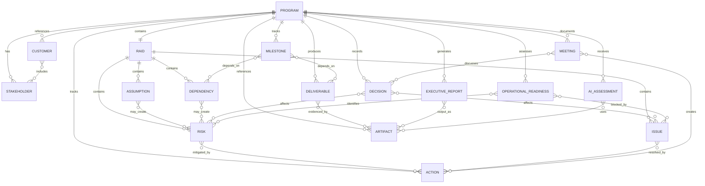

# Program Data Model

This document defines the proposed canonical Program data model for the TPM Operating System.

It is a design document only. The model described here is not implemented in the current codebase. Current program persistence remains local JSON files under `data/programs/`, with the field shape supported by the existing CLI workspace.

## Current Implementation

The current implementation stores each program as one JSON file under `data/programs/`.

Current records are simple and mutable. They support the implemented CLI workspace behaviors:

- Program identity: `program_id`, `program_name`, `description`
- Program state: `phase`, `health`, `confidence`, `last_update`
- Execution lists: `risks`, `issues`, `decisions`, `next_actions`

Current limitations:

- No formal schema version.
- No validation layer.
- No migration layer.
- No canonical IDs for nested records.
- Limited owner, due date, severity, status, and evidence metadata.
- No explicit customer, stakeholder, milestone, deliverable, meeting, artifact, readiness, AI assessment, or executive report entities.
- Generated reports and sessions are stored separately as files and are not strongly linked from the program record.

## Proposed Model

The proposed canonical model should become the durable logical representation of a program. It should support CLI usage first, while leaving room for a future web interface, document ingestion, reporting, and database-backed storage.

The canonical record should be one program aggregate with nested entities while the product remains file-based. If the product later moves to a database, these entities can become relational tables or document collections without changing the business vocabulary.

## Design Principles

- Separate user-entered program state from AI-generated assessments and generated artifacts.
- Preserve evidence, ownership, status, and dates for every operational item.
- Treat missing information as explicit unknowns instead of inventing values.
- Use stable IDs for every entity that may be referenced, updated, closed, reported, or audited.
- Use controlled vocabularies where they improve consistency, but allow notes and evidence for real-world nuance.
- Track created and updated metadata for program records and nested entities.
- Make schema versioning mandatory before migrations are implemented.
- Keep the local JSON representation human-readable and inspectable.
- Do not require a database for the near-term implementation.
- Design for future multi-user and audit requirements without claiming those capabilities exist today.

## Program Entity

The Program entity is the root aggregate.

Required fields:

- `schema_version`: Canonical schema version for the record.
- `program_id`: Stable unique ID, currently compatible with filename-safe slugs.
- `program_name`: Human-readable program name.
- `description`: Short program description.
- `phase`: Current lifecycle phase.
- `health`: Current overall health.
- `confidence`: Confidence level for the current program assessment.
- `metadata`: Record-level metadata.

Recommended fields:

- `business_objective`: Business outcome the program is intended to achieve.
- `scope_summary`: Concise summary of approved scope.
- `out_of_scope`: Explicit exclusions.
- `customer_id`: Reference to the primary customer.
- `sponsor_stakeholder_id`: Reference to the executive sponsor.
- `program_manager_stakeholder_id`: Reference to the accountable TPM or program lead.
- `start_date`: Program start date.
- `target_end_date`: Target completion date.
- `target_go_live_date`: Target production or launch date.
- `status_summary`: Human-authored or TPM-approved summary.
- `health_rationale`: Evidence-based rationale for current health.
- `trend`: Health trend.
- `executive_visibility`: Current leadership visibility level.
- `customers`: Customer entities.
- `stakeholders`: Stakeholder entities.
- `milestones`: Milestone entities.
- `deliverables`: Deliverable entities.
- `raid`: RAID entity.
- `decisions`: Decision entities.
- `actions`: Action entities.
- `meetings`: Meeting entities.
- `artifacts`: Artifact entities.
- `executive_reports`: Executive Report entities.
- `operational_readiness`: Operational Readiness entity.
- `ai_assessments`: AI Assessment entities.

Suggested controlled values:

- `phase`: `pre_sales`, `initiation`, `planning`, `execution`, `hypercare`, `operational_transition`, `closed`
- `health`: `green`, `yellow`, `red`, `unknown`
- `confidence`: `high`, `medium`, `low`, `unknown`
- `trend`: `improving`, `stable`, `deteriorating`, `unknown`
- `executive_visibility`: `none`, `weekly`, `steering_committee`, `executive_escalation`

## Customer Entity

The Customer entity represents the organization, business unit, or account receiving value from the program.

Fields:

- `customer_id`: Stable customer ID.
- `name`: Customer or business unit name.
- `type`: `internal`, `external`, `partner`, or `unknown`.
- `region`: Geographic or operating region.
- `industry`: Optional industry classification.
- `business_owner_stakeholder_id`: Reference to the business owner.
- `success_criteria`: Observable outcomes that define success.
- `constraints`: Commercial, regulatory, technical, timing, or operating constraints.
- `notes`: Additional context.
- `metadata`: Entity metadata.

## Stakeholder Entity

The Stakeholder entity captures people, roles, teams, and decision authorities.

Fields:

- `stakeholder_id`: Stable stakeholder ID.
- `name`: Person, team, or role name.
- `role`: Program role.
- `organization`: Company, function, or team.
- `email`: Optional contact detail.
- `stakeholder_type`: `person`, `team`, `role`, or `unknown`.
- `influence`: `high`, `medium`, `low`, or `unknown`.
- `interest`: `high`, `medium`, `low`, or `unknown`.
- `engagement_status`: `supportive`, `neutral`, `concerned`, `blocked`, or `unknown`.
- `decision_authority`: Decisions this stakeholder can make or approve.
- `communication_preference`: Preferred cadence, channel, or format.
- `notes`: Relationship and context notes.
- `metadata`: Entity metadata.

## Milestone Entity

The Milestone entity represents key program checkpoints.

Fields:

- `milestone_id`: Stable milestone ID.
- `name`: Milestone name.
- `description`: Milestone purpose.
- `baseline_date`: Approved baseline date.
- `forecast_date`: Current forecast date.
- `actual_date`: Completion date, if complete.
- `status`: `not_started`, `in_progress`, `at_risk`, `blocked`, `complete`, or `cancelled`.
- `owner_stakeholder_id`: Accountable owner.
- `depends_on`: List of milestone, deliverable, dependency, or decision IDs.
- `exit_criteria`: Conditions required to mark the milestone complete.
- `evidence_artifact_ids`: Artifact IDs that support status.
- `notes`: Additional detail.
- `metadata`: Entity metadata.

## Deliverable Entity

The Deliverable entity represents outputs the program must produce.

Fields:

- `deliverable_id`: Stable deliverable ID.
- `name`: Deliverable name.
- `description`: Deliverable description.
- `type`: `technical`, `process`, `documentation`, `training`, `operational`, `commercial`, or `other`.
- `owner_stakeholder_id`: Accountable owner.
- `status`: `not_started`, `in_progress`, `review`, `accepted`, `blocked`, `cancelled`.
- `due_date`: Target date.
- `accepted_date`: Acceptance date, if accepted.
- `acceptance_criteria`: Criteria required for acceptance.
- `acceptor_stakeholder_id`: Stakeholder authorized to accept the deliverable.
- `related_milestone_ids`: Milestones supported by the deliverable.
- `evidence_artifact_ids`: Artifact IDs proving completion or acceptance.
- `notes`: Additional detail.
- `metadata`: Entity metadata.

## RAID Entity

The RAID entity groups risks, assumptions, issues, and dependencies. Each item should have an owner. A RAID item without an owner should be treated as unmanaged.

### Risks

Risks are uncertain future events that may affect the program.

Fields:

- `risk_id`: Stable risk ID.
- `description`: Risk statement.
- `cause`: Root cause or trigger.
- `impact_description`: Expected consequence if realized.
- `probability`: `low`, `medium`, `high`, or numeric scale.
- `impact`: `low`, `medium`, `high`, or numeric scale.
- `score`: Calculated or assigned risk score.
- `priority`: `low`, `medium`, `high`, `critical`.
- `owner_stakeholder_id`: Risk owner.
- `mitigation_plan`: Planned risk response.
- `contingency_plan`: Plan if the risk materializes.
- `due_date`: Date for mitigation or review.
- `status`: `open`, `monitoring`, `mitigating`, `accepted`, `closed`.
- `related_milestone_ids`: Affected milestones.
- `related_dependency_ids`: Related dependencies.
- `evidence_artifact_ids`: Supporting evidence.
- `notes`: Additional detail.
- `metadata`: Entity metadata.

### Issues

Issues are current problems already affecting the program.

Fields:

- `issue_id`: Stable issue ID.
- `description`: Issue statement.
- `business_impact`: Business, customer, schedule, financial, or operational impact.
- `severity`: `low`, `medium`, `high`, `critical`.
- `owner_stakeholder_id`: Issue owner.
- `action_plan`: Recovery or resolution plan.
- `due_date`: Target resolution date.
- `status`: `open`, `in_progress`, `blocked`, `resolved`, `closed`.
- `resolution_summary`: How the issue was resolved.
- `resolved_date`: Resolution date.
- `related_milestone_ids`: Affected milestones.
- `related_decision_ids`: Decisions needed or made.
- `evidence_artifact_ids`: Supporting evidence.
- `notes`: Additional detail.
- `metadata`: Entity metadata.

### Assumptions

Assumptions are unverified beliefs that planning currently depends on.

Fields:

- `assumption_id`: Stable assumption ID.
- `statement`: Assumption statement.
- `validation_needed`: What must be verified.
- `owner_stakeholder_id`: Owner responsible for validation.
- `due_date`: Target validation date.
- `status`: `unvalidated`, `validating`, `validated`, `invalidated`, `retired`.
- `impact_if_false`: Impact if the assumption proves incorrect.
- `related_risk_ids`: Risks created by the assumption.
- `evidence_artifact_ids`: Evidence used for validation.
- `notes`: Additional detail.
- `metadata`: Entity metadata.

### Dependencies

Dependencies are external inputs, teams, decisions, systems, or events required by the program.

Fields:

- `dependency_id`: Stable dependency ID.
- `description`: Dependency statement.
- `dependency_type`: `team`, `system`, `vendor`, `customer`, `decision`, `artifact`, `environment`, or `other`.
- `provider`: Team, person, vendor, or system providing the dependency.
- `owner_stakeholder_id`: Internal owner accountable for tracking.
- `external_owner`: External owner when not represented as a stakeholder.
- `required_date`: Date needed by the program.
- `committed_date`: Date committed by provider.
- `status`: `not_started`, `in_progress`, `at_risk`, `blocked`, `met`, `cancelled`.
- `impact`: Impact if not met.
- `related_milestone_ids`: Milestones affected by the dependency.
- `related_risk_ids`: Risks created by the dependency.
- `evidence_artifact_ids`: Supporting evidence.
- `notes`: Additional detail.
- `metadata`: Entity metadata.

## Decision Entity

The Decision entity captures choices, rationale, authority, and outcomes.

Fields:

- `decision_id`: Stable decision ID.
- `title`: Short decision title.
- `description`: Decision context.
- `decision_type`: `operational`, `program`, `executive`, or `unknown`.
- `status`: `proposed`, `needed`, `approved`, `rejected`, `deferred`, `superseded`.
- `decision_owner_stakeholder_id`: Accountable decision owner.
- `requested_by_stakeholder_id`: Requestor.
- `decision_date`: Date decision was made.
- `needed_by_date`: Date decision is needed.
- `options`: Options considered.
- `recommendation`: TPM or team recommendation.
- `rationale`: Evidence-based rationale.
- `business_impact`: Business consequence.
- `reversibility`: `low`, `medium`, `high`, or `unknown`.
- `related_risk_ids`: Related risks.
- `related_issue_ids`: Related issues.
- `related_dependency_ids`: Related dependencies.
- `evidence_artifact_ids`: Supporting evidence.
- `notes`: Additional detail.
- `metadata`: Entity metadata.

## Action Entity

The Action entity tracks work commitments that need follow-up.

Fields:

- `action_id`: Stable action ID.
- `description`: Action statement.
- `owner_stakeholder_id`: Action owner.
- `assigned_by_stakeholder_id`: Assigning stakeholder, if known.
- `due_date`: Target completion date.
- `status`: `open`, `in_progress`, `blocked`, `done`, `cancelled`.
- `priority`: `low`, `medium`, `high`, `critical`.
- `source_type`: `meeting`, `risk`, `issue`, `decision`, `readiness`, `manual`, or `ai_assessment`.
- `source_id`: Source entity ID.
- `related_milestone_ids`: Related milestones.
- `completion_summary`: Summary when completed.
- `completed_date`: Completion date.
- `evidence_artifact_ids`: Supporting evidence.
- `notes`: Additional detail.
- `metadata`: Entity metadata.

## Meeting Entity

The Meeting entity captures governance, working sessions, reviews, and decision meetings.

Fields:

- `meeting_id`: Stable meeting ID.
- `title`: Meeting title.
- `meeting_type`: `standup`, `working_session`, `steering_committee`, `executive_review`, `readiness_review`, `incident_review`, `customer_review`, or `other`.
- `date`: Meeting date.
- `facilitator_stakeholder_id`: Facilitator.
- `attendee_stakeholder_ids`: Attendees represented in the stakeholder list.
- `external_attendees`: Attendees not represented as stakeholder records.
- `agenda`: Agenda items.
- `summary`: Meeting summary.
- `decision_ids`: Decisions made or discussed.
- `action_ids`: Actions created or reviewed.
- `raid_item_ids`: RAID items reviewed.
- `artifact_ids`: Notes, decks, recordings, or related files.
- `notes`: Additional detail.
- `metadata`: Entity metadata.

## Artifact Entity

The Artifact entity references files, generated outputs, source documents, and evidence.

Fields:

- `artifact_id`: Stable artifact ID.
- `title`: Artifact title.
- `artifact_type`: `prompt`, `ai_response`, `executive_report`, `deck`, `sow`, `runbook`, `architecture`, `readiness_evidence`, `meeting_notes`, `other`.
- `path`: Local file path or future URI.
- `source`: `user_uploaded`, `generated`, `imported`, `manual_reference`, or `external`.
- `generated_by`: Tool, flow, or model that generated it, if applicable.
- `created_date`: Artifact creation date.
- `related_entity_type`: Primary related entity type.
- `related_entity_id`: Primary related entity ID.
- `summary`: Short summary.
- `checksum`: Optional future integrity value.
- `metadata`: Entity metadata.

## Executive Report Entity

The Executive Report entity tracks report outputs and the evidence behind them.

Fields:

- `report_id`: Stable report ID.
- `title`: Report title.
- `report_type`: `status`, `steering_committee`, `readiness`, `incident`, `portfolio`, or `other`.
- `report_date`: Report date.
- `audience`: Intended audience.
- `health`: Reported health.
- `trend`: Reported trend.
- `confidence`: Reported confidence.
- `summary`: Executive summary.
- `decisions_required`: Decision IDs requiring leadership action.
- `top_risk_ids`: Top risks included.
- `critical_issue_ids`: Critical issues included.
- `key_dependency_ids`: Dependencies highlighted.
- `action_ids`: Actions highlighted.
- `artifact_id`: Generated report artifact ID.
- `generated_from_snapshot`: Optional snapshot reference or timestamp.
- `metadata`: Entity metadata.

## Operational Readiness Entity

The Operational Readiness entity captures readiness for go-live, transition, support acceptance, or hypercare exit.

Fields:

- `readiness_id`: Stable readiness assessment ID.
- `assessment_date`: Assessment date.
- `assessor_stakeholder_id`: Assessor.
- `scope`: Readiness scope.
- `overall_status`: `not_started`, `in_progress`, `ready`, `ready_with_risks`, `not_ready`, `unknown`.
- `recommendation`: `go`, `go_with_risks`, `no_go`, or `unknown`.
- `overall_score`: Optional numeric score.
- `domains`: Readiness domains.
- `blocking_issue_ids`: Issue IDs blocking readiness.
- `operational_risk_ids`: Risk IDs related to transition or supportability.
- `required_action_ids`: Actions required before transition.
- `evidence_artifact_ids`: Evidence reviewed.
- `support_owner_stakeholder_id`: Accepted operational owner.
- `hypercare_plan_artifact_id`: Hypercare plan reference.
- `acceptance_date`: Operations acceptance date.
- `notes`: Additional detail.
- `metadata`: Entity metadata.

Readiness domain fields:

- `domain_id`
- `name`
- `weight`
- `status`
- `score`
- `blocking`
- `evidence_artifact_ids`
- `notes`

Recommended domains:

- Documentation
- Monitoring and alerting
- Backup and recovery
- Security readiness
- Knowledge transfer
- Support ownership
- Licensing and assets

## AI Assessment Entity

The AI Assessment entity separates generated analysis from human-approved program state.

Fields:

- `assessment_id`: Stable assessment ID.
- `assessment_type`: `initial_program_assessment`, `risk_review`, `readiness_review`, `executive_summary`, `council_review`, or `other`.
- `created_date`: Assessment creation date.
- `model_provider`: AI provider, if applicable.
- `model_name`: Model name, if known.
- `prompt_artifact_id`: Prompt artifact reference.
- `response_artifact_id`: Response artifact reference.
- `input_entity_refs`: Entities used as assessment context.
- `summary`: Short assessment summary.
- `recommendations`: AI-generated recommendations.
- `confidence`: AI-stated confidence.
- `missing_information`: Missing inputs identified by the model.
- `human_review_status`: `unreviewed`, `accepted`, `partially_accepted`, `rejected`.
- `accepted_entity_refs`: Entities updated after human review, if any.
- `metadata`: Entity metadata.

AI assessments must not be treated as authoritative program state until reviewed and accepted by the TPM or accountable owner.

## Metadata

Every root record and nested entity should support metadata.

Fields:

- `created_at`: ISO 8601 timestamp.
- `created_by`: User, system, import process, or migration.
- `updated_at`: ISO 8601 timestamp.
- `updated_by`: User, system, import process, or migration.
- `source`: `manual`, `cli`, `ai_generated`, `migration`, `import`, or `system`.
- `version`: Optional entity-level revision counter.
- `tags`: Optional classification tags.
- `archived`: Boolean archive marker.

Optional future audit fields:

- `change_reason`
- `previous_status`
- `correlation_id`
- `tenant_id`
- `visibility`

## Schema Versioning Strategy

The canonical program record should include a required `schema_version`.

Recommended initial version:

- `schema_version`: `1.0.0`

Versioning rules:

- Patch version changes should add clarifications or optional fields without breaking existing records.
- Minor version changes may add optional entities, optional fields, or new controlled values.
- Major version changes may rename fields, change required fields, or restructure entities.
- Each migration should declare source version, target version, transformation rules, and fallback behavior.
- Unknown future versions should be handled conservatively by loading read-only or rejecting mutation with a clear error.
- Records without `schema_version` should be treated as legacy records.

## Migration Strategy

Migration should be explicit and testable. Existing JSON should not be silently rewritten until a migration command or application startup migration policy is designed and implemented.

Legacy record mapping:

| Current field | Proposed field |
|---|---|
| `program_id` | `program.program_id` |
| `program_name` | `program.program_name` |
| `description` | `program.description` |
| `phase` | `program.phase` after value normalization |
| `health` | `program.health` after value normalization |
| `confidence` | `program.confidence` after value normalization |
| `risks` | `program.raid.risks` |
| `issues` | `program.raid.issues` |
| `decisions` | `program.decisions` |
| `next_actions` | `program.actions` |
| `last_update` | `program.metadata.updated_at` when valid |

Migration rules:

- Add `schema_version`.
- Preserve all legacy values even when incomplete.
- Generate stable nested IDs for risks, issues, decisions, and actions.
- Normalize enum values where safe, such as `Unknown` to `unknown`.
- Use `metadata.source = "migration"` for migrated entities.
- Leave unknown owner, due date, priority, and evidence fields as `null` or empty arrays.
- Store unmapped legacy data in `notes` or a migration metadata field when needed.
- Do not infer customers, stakeholders, milestones, deliverables, readiness, meetings, or artifacts unless the legacy record explicitly contains enough information.
- Preserve original JSON before destructive migrations. A future implementation should write backups or produce migrated copies first.

Suggested migration phases:

1. Read legacy and canonical records through a compatibility loader.
2. Add validation that reports missing or malformed fields without changing files.
3. Add an explicit migration command that writes canonical JSON copies.
4. Add tests for legacy examples and malformed records.
5. Switch write paths to canonical schema only after compatibility is proven.

## Future Evolution

Future model evolution may include:

- Portfolio-level entities that group multiple programs.
- Organization-level configuration for health thresholds and risk scoring.
- Audit logs for every state change.
- Multi-user permissions and approval workflows.
- Rich document ingestion and extraction provenance.
- Integration references for Jira, Azure DevOps, ServiceNow, Slack, Teams, Google Drive, SharePoint, or other systems.
- Stronger AI Expert Council outputs linked to decisions, risks, readiness, and executive reports.
- Historical snapshots for trend analysis.
- Baseline management for scope, schedule, budget, and benefits.

These are future design directions, not current implementation claims.

## Future Database Considerations

The local JSON aggregate is appropriate for the current CLI implementation. A future database should be considered if the product needs collaboration, concurrency, portfolio queries, permissions, auditability, or hosted operation.

Relational database candidates:

- Programs
- Customers
- Stakeholders
- Milestones
- Deliverables
- RAID items
- Decisions
- Actions
- Meetings
- Artifacts
- Executive reports
- Operational readiness assessments
- AI assessments
- Audit events

Document database candidates:

- One program document per aggregate.
- Embedded arrays for nested operational entities.
- Separate artifact and audit collections for large or frequently queried records.

Design considerations:

- Keep entity IDs stable across storage backends.
- Avoid database-specific concepts in the business model.
- Add optimistic concurrency for multi-user updates.
- Store generated artifacts outside core program rows when files become large.
- Treat audit history as append-only.
- Add tenant and authorization boundaries before any SaaS use.

## Example Canonical JSON

```json
{
  "schema_version": "1.0.0",
  "program_id": "microsoft-teams-latam",
  "program_name": "Microsoft Teams LATAM",
  "description": "Microsoft Teams deployment for 8000 users in Mexico, Colombia and Chile.",
  "business_objective": "Enable standardized collaboration across LATAM users.",
  "scope_summary": "Deploy Microsoft Teams to Mexico, Colombia, and Chile user populations.",
  "out_of_scope": [],
  "phase": "initiation",
  "health": "unknown",
  "confidence": "medium",
  "trend": "unknown",
  "executive_visibility": "none",
  "customer_id": "customer-latam-business",
  "sponsor_stakeholder_id": null,
  "program_manager_stakeholder_id": null,
  "start_date": null,
  "target_end_date": null,
  "target_go_live_date": null,
  "status_summary": null,
  "health_rationale": null,
  "customers": [
    {
      "customer_id": "customer-latam-business",
      "name": "LATAM Business",
      "type": "internal",
      "region": "LATAM",
      "industry": null,
      "business_owner_stakeholder_id": null,
      "success_criteria": [],
      "constraints": [],
      "notes": null,
      "metadata": {
        "created_at": null,
        "created_by": "migration",
        "updated_at": null,
        "updated_by": "migration",
        "source": "migration",
        "version": 1,
        "tags": [],
        "archived": false
      }
    }
  ],
  "stakeholders": [],
  "milestones": [],
  "deliverables": [],
  "raid": {
    "risks": [
      {
        "risk_id": "risk-001",
        "description": "Adoption risk in Colombia due to limited change management readiness.",
        "cause": null,
        "impact_description": null,
        "probability": "unknown",
        "impact": "unknown",
        "score": null,
        "priority": "medium",
        "owner_stakeholder_id": null,
        "mitigation_plan": null,
        "contingency_plan": null,
        "due_date": null,
        "status": "open",
        "related_milestone_ids": [],
        "related_dependency_ids": [],
        "evidence_artifact_ids": [],
        "notes": null,
        "metadata": {
          "created_at": null,
          "created_by": "migration",
          "updated_at": null,
          "updated_by": "migration",
          "source": "migration",
          "version": 1,
          "tags": [],
          "archived": false
        }
      }
    ],
    "issues": [],
    "assumptions": [],
    "dependencies": []
  },
  "decisions": [],
  "actions": [],
  "meetings": [],
  "artifacts": [
    {
      "artifact_id": "artifact-executive-status-001",
      "title": "Microsoft Teams LATAM Executive Status",
      "artifact_type": "executive_report",
      "path": "reports/executive/microsoft-teams-latam_executive_status.md",
      "source": "generated",
      "generated_by": "current_cli",
      "created_date": null,
      "related_entity_type": "program",
      "related_entity_id": "microsoft-teams-latam",
      "summary": null,
      "checksum": null,
      "metadata": {
        "created_at": null,
        "created_by": "migration",
        "updated_at": null,
        "updated_by": "migration",
        "source": "migration",
        "version": 1,
        "tags": [],
        "archived": false
      }
    }
  ],
  "executive_reports": [
    {
      "report_id": "report-001",
      "title": "Microsoft Teams LATAM Executive Status",
      "report_type": "status",
      "report_date": null,
      "audience": "executive",
      "health": "unknown",
      "trend": "unknown",
      "confidence": "medium",
      "summary": null,
      "decisions_required": [],
      "top_risk_ids": ["risk-001"],
      "critical_issue_ids": [],
      "key_dependency_ids": [],
      "action_ids": [],
      "artifact_id": "artifact-executive-status-001",
      "generated_from_snapshot": null,
      "metadata": {
        "created_at": null,
        "created_by": "migration",
        "updated_at": null,
        "updated_by": "migration",
        "source": "migration",
        "version": 1,
        "tags": [],
        "archived": false
      }
    }
  ],
  "operational_readiness": {
    "readiness_id": "readiness-001",
    "assessment_date": null,
    "assessor_stakeholder_id": null,
    "scope": null,
    "overall_status": "unknown",
    "recommendation": "unknown",
    "overall_score": null,
    "domains": [],
    "blocking_issue_ids": [],
    "operational_risk_ids": [],
    "required_action_ids": [],
    "evidence_artifact_ids": [],
    "support_owner_stakeholder_id": null,
    "hypercare_plan_artifact_id": null,
    "acceptance_date": null,
    "notes": null,
    "metadata": {
      "created_at": null,
      "created_by": "migration",
      "updated_at": null,
      "updated_by": "migration",
      "source": "migration",
      "version": 1,
      "tags": [],
      "archived": false
    }
  },
  "ai_assessments": [],
  "metadata": {
    "created_at": null,
    "created_by": "migration",
    "updated_at": null,
    "updated_by": "migration",
    "source": "migration",
    "version": 1,
    "tags": [],
    "archived": false
  }
}
```

## Relationship Diagram


